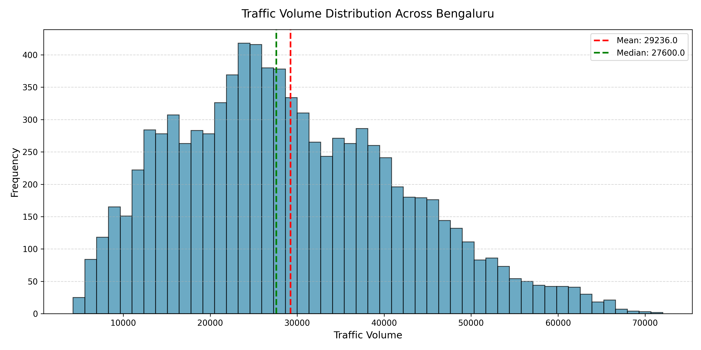
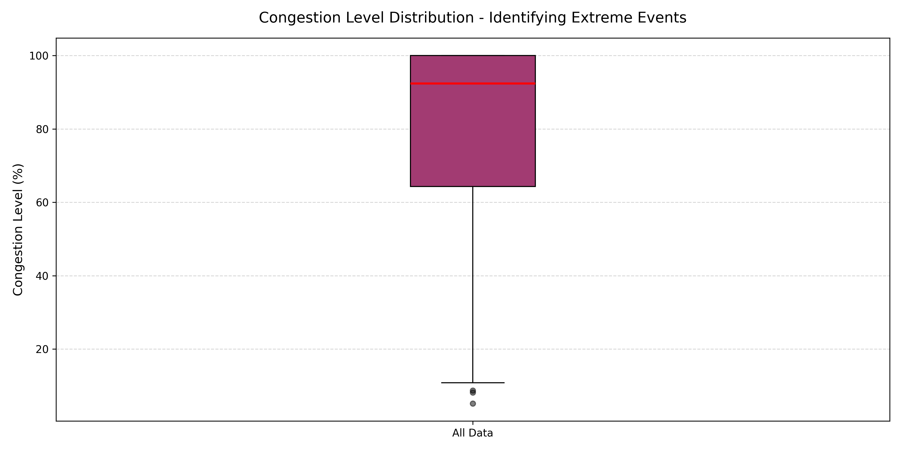
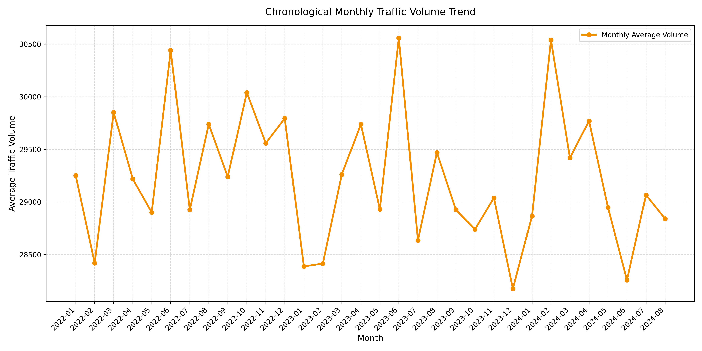
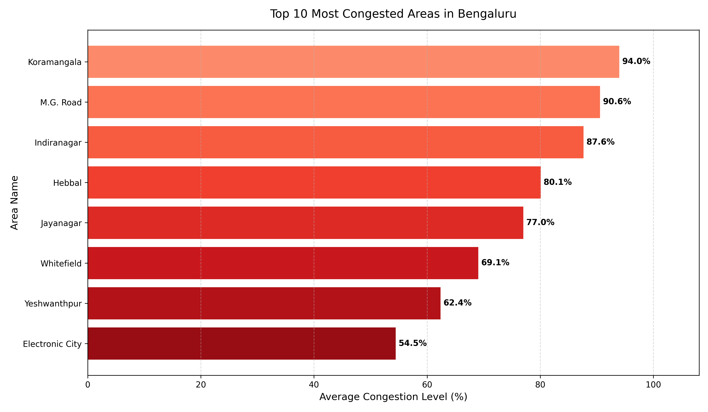
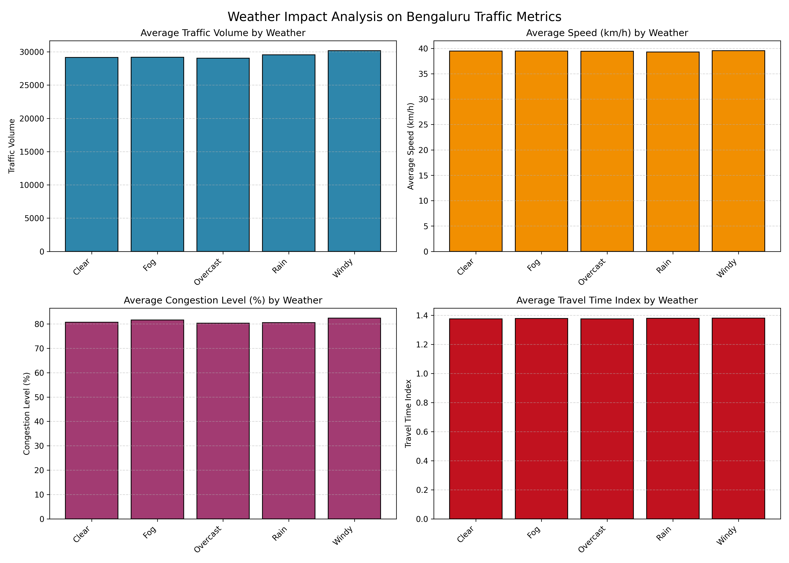
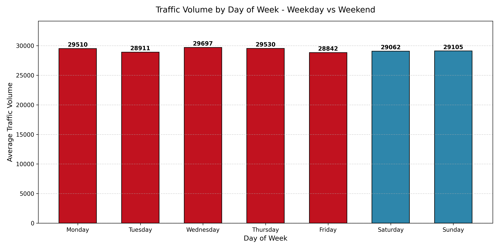

# Bengaluru Traffic Congestion Analysis

An end-to-end data science analysis of historical traffic metrics across Bengaluru, diagnosing geographical hotspots, weather-induced delays, volume-speed dynamics, and weekly cycles.

## Project Overview

Bengaluru, India's preeminent tech metropolis, is home to a rapidly growing population and a massive transportation network that faces extreme daily traffic congestion. This project performs a detailed data science analysis of historical traffic metrics, diagnosing congestion hotspots, weather-induced delays, and volume-speed dynamics to propose a series of data-driven, strategic urban mobility conclusions.

## Problem Statement

Bengaluru experiences severe traffic congestion during peak hours, which significantly impacts daily commute times, increases fuel consumption, and degrades localized environmental air quality. Rapid economic expansion has led to vehicular demand outstripping the capacity of historical roadways, creating chronic gridlock across major commercial and IT corridors.

This analysis aims to identify the underlying structural causes of congestion by investigating the relationship between traffic volume, average speed, capacity utilization, and weather conditions. Understanding these patterns enables urban planners to move from reactive capacity extension to proactive, intelligent traffic management and demand-side solutions.

## Dataset

- **Total Records:** 8,936
- **Total Features:** 16
- **Time Range:** 2022-01-01 to 2024-08-09
- **Coverage:** 8 areas, 16 roads/intersections

### Features:
1. `date` - Date of traffic observation (YYYY-MM-DD).
2. `area_name` - The locality/area in Bengaluru (e.g., Koramangala, Indiranagar).
3. `road_intersection_name` - The specific intersection or road name.
4. `traffic_volume` - Estimated vehicle count during the observation interval.
5. `average_speed` - Average speed of vehicles traversing the road in km/h.
6. `travel_time_index` - Ratio of travel time during congestion compared to free-flow conditions.
7. `congestion_level` - Estimated percentage level of congestion (0% - 100%).
8. `road_capacity_utilization` - The ratio of volume to maximum road capacity.
9. `incident_reports` - Number of active traffic incidents (crashes, breakdowns) reported.
10. `environmental_impact` - Estimated emissions index calculated from volume and speed.
11. `public_transport_usage` - Estimated share of public transport commuters on this corridor.
12. `traffic_signal_compliance` - Average signal compliance index.
13. `parking_usage` - Average parking slot utilization rate.
14. `pedestrian_and_cyclist_count` - Non-motorized user count in the zone.
15. `weather_conditions` - Weather at observation (Clear, Rain, Fog, Overcast, Windy).
16. `roadwork_and_construction_activity` - Active construction markers (Yes / No).

## Project Methodology

1. **Dataset Collection:** Daily traffic observations across major routes.
2. **Data Cleaning:** Validating nulls, duplicates, and standardizing schemas.
3. **Feature Engineering:** Extracting day of week, month, quarter, and year temporal features.
4. **Exploratory Data Analysis:** Analyzing statistical properties and correlations.
5. **Visualization:** Generating high-resolution plots mapping urban trends.
6. **Synthesis:** Drawing structured, data-grounded conclusions.

## Data Cleaning

- **Missing Value Handling:** Verified raw dataset had 0 missing values initially. The pipeline ensures robust imputation where numeric missing values are forward-filled (and backward-filled if still missing) and categorical missing values are mode-imputed.
- **Duplicate Removal:** Checked for duplicate records (0 duplicates found) and enforced deduplication in-place.
- **Column Standardization:** Converted all 16 raw column headers to lowercase and replaced spaces and slashes with underscores (e.g., "Road/Intersection Name" became "road_intersection_name").
- **DateTime Conversion:** Parsed the `date` string to datetime objects and extracted standard components: `day_of_week`, `month`, `quarter`, and `year` to support temporal trend analysis. Hourly analysis was omitted since the dataset contains daily-level granularity.

## Exploratory Data Analysis

### Visualizations:

1. **Traffic Volume Distribution (Histogram)**
   
   Insight: Volume follows a right-skewed normal distribution, averaging 29,236 vehicles, with a wide standard deviation.

2. **Congestion Level Distribution (Boxplot)**
   
   Insight: Median congestion level is high at 92.39%, representing chronic gridlock as the standard baseline state.

3. **Chronological Monthly Traffic Trend (Line Chart)**
   
   Insight: Captures monthly average traffic volume fluctuations over the 2022-2024 period, capturing long-term growth and seasonal trends.

4. **Traffic Volume vs Speed (Scatter Plot)**
   
   Insight: Average speed decays rapidly and non-linearly as traffic volume increases, showing a correlation coefficient of -0.3411.

5. **Top 10 Most Congested Areas (Bar Chart)**
   
   Insight: Congestion is highly concentrated around major commercial and IT hubs, with Koramangala (93.99%), M.G. Road (90.58%), and Indiranagar (87.64%) being the top spots.

6. **Weather Impact Analysis (Subplots)**
   
   Insight: Congestion level averages remain uniform across clear and rainy weather conditions (-0.23% difference), showing that capacity constraints drive gridlock more than weather.

7. **Traffic Volume by Day of Week (Bar Chart)**
   
   Insight: Weekday traffic exceeds weekend traffic marginally (0.73% difference), showing congestion is persistent throughout the entire week.

## Research Findings & Conclusions

- **Finding 1 (Weekly Persistence):** Weekend volume is only 0.73% lower than weekdays, showing congestion is persistent throughout the entire week.
- **Finding 2 (Geographic Hotspots):** Congestion is heavily concentrated in major IT/commercial hubs: Koramangala (93.99%), M.G. Road (90.58%), and Indiranagar (87.64%).
- **Finding 3 (Weather Impact Assessment):** Weather conditions have negligible impact (rain averages 80.54% vs clear at 80.72%, a difference of -0.23%).
- **Finding 4 (Volume-Speed Correlation):** Strong negative correlation (-0.3411) showing average speed collapses to a floor of 20 km/h under high volumes.
- **Future Work:** Deployment of sub-daily telemetric traffic logs and integration of public transit metro/bus passenger flows.

## Assumptions & Limitations

### Assumptions:
1. Dataset accurately represents Bengaluru traffic patterns.
2. Weather information is correctly recorded and consistent.
3. Traffic volume directly correlates with congestion levels.
4. Data collection methodology remained constant.
5. External factors are randomly distributed.

### Limitations:
1. NO HOURLY TIMESTAMPS: The dataset contains daily-level dates (YYYY-MM-DD), preventing sub-daily morning/evening peak hour trend calculations.
2. Geographical coverage is restricted to 8 key areas in Bengaluru.
3. Specific traffic incidents (crashes, construction) are represented as daily aggregate counts.
4. Air quality indices are calculated metrics rather than directly measured.
5. Integration with city public transport network volumes is not included.

## Technologies Used

- Python 3.11
- Pandas (data manipulation)
- NumPy (numerical operations)
- Matplotlib & Seaborn (visualization)
- Jupyter Notebook (analysis)
- HTML5, CSS3, & Vanilla JS (insights dashboard website)

## Project Structure

```
bengaluru-traffic-congestion-analysis/
├── raw_data/
│   └── Banglore_traffic_Dataset.csv
├── processed_data/
│   └── cleaned_traffic_data.csv
├── notebooks/
│   └── traffic_analysis.ipynb
├── outputs/
│   ├── histogram_traffic_volume.png
│   ├── boxplot_congestion_level.png
│   ├── lineplot_monthly_traffic.png
│   ├── scatterplot_volume_speed.png
│   ├── barchart_top_congested_areas.png
│   ├── weather_impact_analysis.png
│   └── traffic_by_day_of_week.png
├── website/
│   ├── index.html
│   └── style.css
├── docs/
│   ├── key_findings.txt
│   ├── assumptions_limitations.txt
│   └── executive_summary.txt
├── README.md
└── requirements.txt
```

## Author

Rithvik Krishna DK  
June 2026

## License

This project is for educational purposes.
